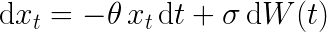

# KramersMoyal
KramersMoyal is a python package designed to recover the Kramers–Moyal coefficients from data. The package is currently capable of recovering one- and two-dimensional Kramers–Moyal coefficients, i.e., from data with one or two dimensions

# A one-dimensional stochastic process
Take for example the well documented one-dimension Ornstein–Uhlenbeck process, see [here](https://en.wikipedia.org/wiki/Ornstein%E2%80%93Uhlenbeck_process). This process is governed by two main parameters: the mean-reverting parameter &theta and the diffusion parameter &#945;

which can be solved in various ways. For our purposes, we recognise that the drift coefficients, i.e., the first-order Kramers–Moyal coefficient is given by 
