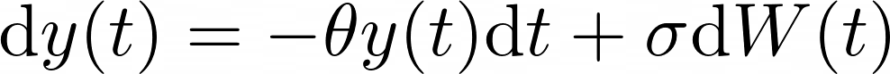

# KramersMoyal
KramersMoyal is a python package designed to recover the Kramers–Moyal coefficients from data. The package is currently capable of recovering one- and two-dimensional Kramers–Moyal coefficients, i.e., from data with one or two dimensions

# A one-dimensional stochastic process
Take for example the well documented one-dimension Ornstein–Uhlenbeck process, see [here](https://en.wikipedia.org/wiki/Ornstein%E2%80%93Uhlenbeck_process). This process is governed by two main parameters: the mean-reverting parameter &theta; and the diffusion parameter &sigma;

which can be solved in various ways. For our purposes, recall that the drift coefficients, i.e., the first-order Kramers–Moyal coefficient is given by  and the second-order Kramers–Moyal coefficient is .

Generate an exemplary Ornstein–Uhlenbeck process with your favorite integrator, e.g., the [Euler–Maruyama](https://en.wikipedia.org/wiki/Euler%E2%80%93Maruyama_method) or with a more powerful tool from [`JiTCSDE`](https://github.com/neurophysik/jitcsde) found on GitHub.
For this example lets take  &theta;=2 and &sigma;=1, over a total time of 1000 units, with a sampling of 100 Hertz,
